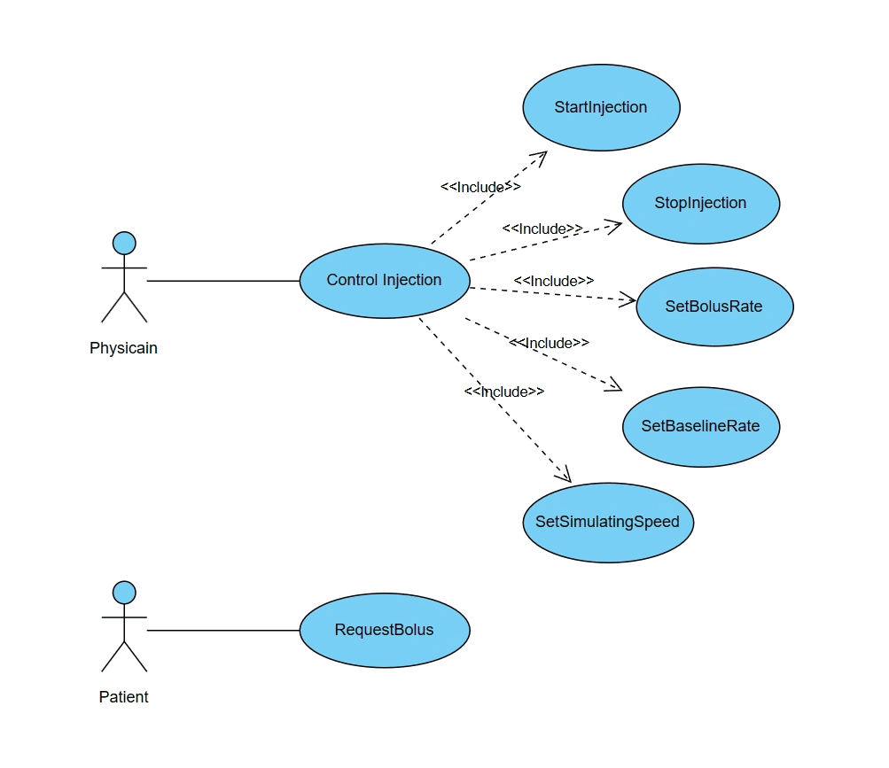
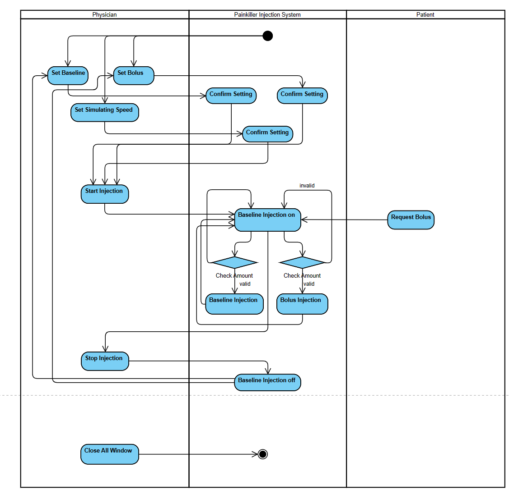

# Requirement document

##  Table of Contents
1. [Software Objective](#software-objective)
2. [Limitations](#limitations)
3. [Class Diagram](#class-diagram)
4. [Usecase Diagram](#usecase-diagram)
5. [Activity Diagram](#activity-diagram)
6. [Software Requirements](#software-requirements)

## Software Objective

Painkillers are mainly used for early post-surgical analgesia, patients who cannot tolerate oral medication, or severe pain caused by advanced cancer, with a faster onset of action. However, painkillers should not be used indiscriminately, and after the patient's pain symptoms have been relieved, it is recommended that the medication be discontinued, otherwise it will cause very dangerous results.

Our goal is to design and develop a software called "Painkiller Injection System", which is designed to help physicians and patients to manage the painkiller injection process for saving time and to ensure rational painkiller drug use and safety.

## Limitations
1. The total amount: **3** ml/day.
2. Amount in a short period: **1** ml/hr
3. Baseline: **0.01 - 0.1** ml/min
4. Bolus: **0.2 - 0.5** ml/shot
5. Interfaces: one for physician and one patient

## Class Diagram

## UseCase Diagram

## Activity Diagram

## Software Requirements
### R1: Patient UI
+ R1.1: The Patient UI should support basic functionalities.
    + R1.1.1: The Patient UI should be able to request bolus after injection is started.
    + R1.1.2: The Patient UI should make it invalid when injection is stopped.

### R2: Physician UI
+ R2.1: The physician user interface should be able to support basic functionalities.
    + R2.1.1: The physician user interface should be able to start injection when given a valid baseline rate and a valid bolus rate.
    + R2.1.2: The physician user interface should be able to stop injection after injection is started.
    + R2.1.3: The physician user interface should be able to change baseline rate when given a valid baseline rate.
    + R2.1.4: The physician user interface should be able to change bolus rate when given a valid bolus rate.
    + R2.1.5: The physician user interface should be able to change simulating speed.

+ R2.2: The physician user interface should be able to check the validality of some values.
    + R2.2.1: The physician user interface should be able to check whether the baseline rate typed in is between 0.01ml/min and 0.1ml/min.
    + R2.2.2: The physician user interface should be able to check whether the bolus rate typed in is between 0.2ml/slot and 0.5ml/slot.
    + R2.2.3: The physician user interface should be able to check whether the amount in an hour should be less than 1ml.
    + R2.2.4: The physician user interface should be able to check whether the total amount in one day should be less than 3ml.

+ R2.3: The physician user interface should be able to support injection functionalities.
    + R2.3.1: The physician user interface should be able to inject the amount of baseline according to the baseline rate setting before.
    + R2.3.2: The physician user interface should be able to inject the amount of bolus according to the bolus rate setting before.

+ R2.4: The physician user interface should be able to display some important information after starting injection.
    + R2.4.1: The physician user interface should be able to record the baseline rate setting before starting injection and display it.
    + R2.4.2: The physician user interface should be able to record the simulating speed setting before starting injection and display it.
    + R2.4.3: The physician user interface should be able to record the bolus rate setting before starting injection and display it.
    + R2.4.4: The physician user interface should be able to record injection time every simulating minute and display it.
    + R2.4.5: The physician user interface should be able to record injection amount in an hour every simulating minute and display it.
    + R2.4.6: The physician user interface should be able to record injection amount in one day every simulating minute and display it.
    + R2.4.7: The physician user interface should be able to display the injection state, for example, "Baseline injection successfully!".
    + R2.4.8: The physician user interface should be able to display the curve of Total Injection Amount vs Time for visualization.

+ R2.5: The physician user interface should promise safety. 
    + R2.5.1: The physician user interface should not allow the users to press the `Set Baseline` button to change the baseline rate after starting injection.
    + R2.5.2: The physician user interface should not allow the users to press the `Set Bolus` button to change the bolus rate after starting injection.
    + R2.5.3: The physician user interface should not allow the users to press the `Start Injection` button after starting injection.