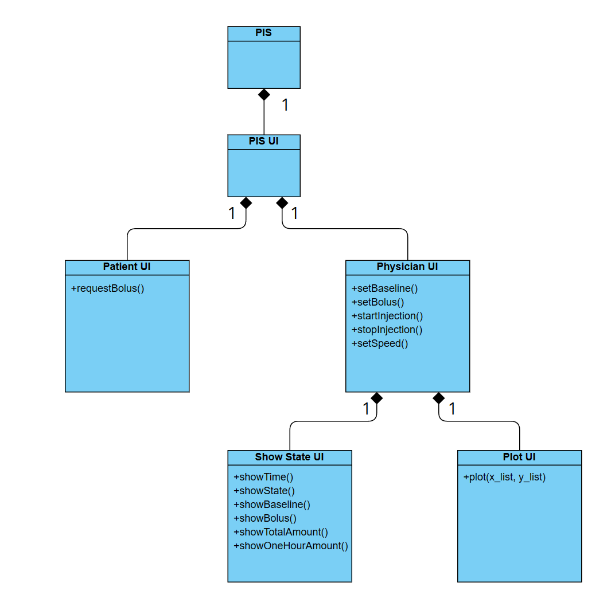
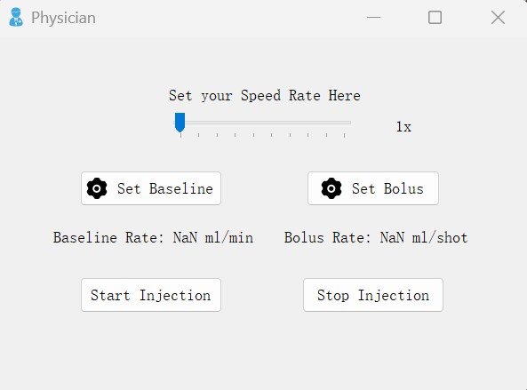
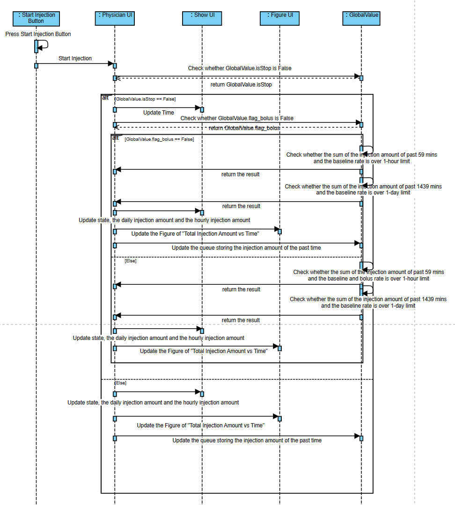

# Specification

##  Table of Contents

1. [System Architecture](#system-architecture)
2. [Software Specification](#software-specification)
    + [S1: Patient UI](#s1-patient-ui)
        + [S1.1: Request Bolus](#s11-request-bolus)
    + [S2: Physician UI](#s2-physician-ui)
        + [S2.1: Set Baseline Rate](#s21-set-baseline-rate)
        + [S2.2 Set Bolus Rate](#s22-set-bolus-rate)
        + [S2.3 Set Simulating Speed](#s23-set-simulating-speed)
        + [S2.4 Start Injection](#s24-start-injection)
        + [S2.5 Stop Injection](#s25-stop-injection)

## System Architecture
The system architecture is shown below:

## Software Specification
### S1: Patient UI

#### S1.1: Request Bolus
+ S1.1.1: Press the `Request Bolus` button.
    + Check whether the global variable `isStop` is False
        + a. If `isStop` is False, which means that the the PIS is starting injection, set the global variable `flag_bolus` to True.
        + b. If `isStop` is True, nothing happens.

### S2: Physician UI

#### S2.1 Set Baseline Rate
+ S2.1.1: Press the `Set Baseline` button.
    + Call on the `Baseline Rate Setting` window to show.

    
+ S2.1.2: Drag the slider to set the baseline rate as `float(slider.value() / 100)` between 0.01 to 0.1 because the slider only support for integer.
    + Update the selected baseline rate on the label under the slider.
+ S2.1.3: Press `Confirm` button or `Back` button to exit.
    a. Press the `Confirm` button to set the global baseline rate as the selected baseline rate, an information message box would pop up to tell the users `Baseline Rate is set successfully` and update this rate on the label under the `Set Baseline` button on the Physician UI.
    b. Press the `Back` button to do nothing and return to the Physician UI window.

#### S2.2 Set Bolus Rate
+ S2.2.1: Press the `Set Bolus` button.
    + Call on the `Bolus Rate Setting` window to show.

    
+ S2.2.2: Drag the slider to set the bolus rate as `float(slider.value() / 100)` between 0.2 to 0.5 because the slider only support for integer.
    + Update the selected bolus rate on the label under the slider.
+ S2.2.3: Press `Confirm` button or `Back` button to exit.
    a. Press the `Confirm` button to set the global bolus rate as the selected bolus rate, an information message box would pop up to tell the users `Bolus Rate is set successfully` and update this rate on the label under the `Set Bolus` button on the Physician UI.
    b. Press the `Back` button to do nothing and return to the Physician UI window.

#### S2.3 Set Simulating Speed
+ S2.3.1: Drag the slider to set the speed on the Phycisian UI.
    + Update the selected speed rate on the label at the right side of the slider.
    + Update the interval of Timer as `int(1000 / speed)` used for simulating time elapse.
    + If it is done after starting injection, update the selected speed rate on the label on the `Show` window.   

#### S2.4 Start Injection
+ S2.4.1: Press the `Start Injection` button.
    + Check whether both the baseline rate and the bolus rate are valid before the button is pressed through the global value GlobalValue.RT_baseline_rate and GlobalValue.RT_bolus_rate.
        + a. Both the baseline rate and the bolus rate are invalid, a message box would pop up to tell the users `Both Baseline rate and Bolus rate have not been set!` and stop starting injection.
        + b. The baseline rate is invalid and the bolus rate is valid, a message box would pop up to tell the users `Baseline Rate has not been set!` and stop starting injection.
        + c. The bolus rate is invalid and the baseline rate is valid, a message box would pop up to tell the users `Bolus Rate has not been set!` and stop starting injection.
    + Make the `Set Baseline` button, `Set Bolus` button and `Start Injection` button unclickable, which prevents the users to click these buttons during injecting.
    + Call on the `Show` window which shows some important information to show.
    

    + Call on the `Display` window which shows a figure of `Total Injection Amount vs Time`.
    

    
    + Set the state variable `self.stop` False and the global variable `isStop` False, which change the state to be `starting`.
    + Start the QTimer `Timer` with the related speed (if not set, default speed is `1x`).
+ S2.4.2: Call on the `time_update` function which is connected to the QTimer `Timer`
    + Check whether the state variable `self.stop` or the global value `GlobalValue.isStop` is False.
        + If the state variable `self.stop` is False
            + Update the time on the `Show` window
            + Check whether the global variable `GlobalValue.flag_bolus` is False
                + a. If `GlobalValue.flag_bolus` is False, the injection amount for this time only consider the baseline rate.
                + b. If `GlobalValue.flag_bolus` is True, the injection amount for this time only consider the sum of the baseline rate and the bolus rate.
            + Calculate the sum of the injection amount of past 59 minutes and the injection amount for this time and the sum of 1439 minutes and the injection amount for this time and check whether it is over the one-hour limit or the one-day limit.
                + a. If both are under the limits, injection succeeds according to the injection amount for this time above. Update the state, the daily injection amount and the hourly injection amount on the `Show` window.
                + b. If it is over the one-hour limit, injection fails. Update the state, the daily injection amount and the hourly injection amount on the `Show` window.
                + c. If it is over the one-day limit, injection fails. Update the state, the daily injection amount and the hourly injection amount on the `Show` window.
                + d. If both are over the limits,  injection fails. Update the state, the daily injection amount and the hourly injection amount on the `Show` window.
            + Update the Figure of `Total Injection Amount vs Time`
            + Update the queue storing the injection amount of the past time
        + If the state variable `self.stop` is True
            + Update the time, state, the daily injection amount and the hourly injection on the `Show` window
            + Update the Figure of `Total Injection Amount vs Time`
            + Update the queue storing the injection amount of the past time

#### S2.5 Stop Injection
+ S2.5.1: Press the `Stop Injection` button.
    + Set the state variable `self.stop` True and the global variable `isStop` True, which change the state to be `stopping`.
    + Make the `Set Baseline` button, `Set Bolus` button and `Start Injection` button clickable.

