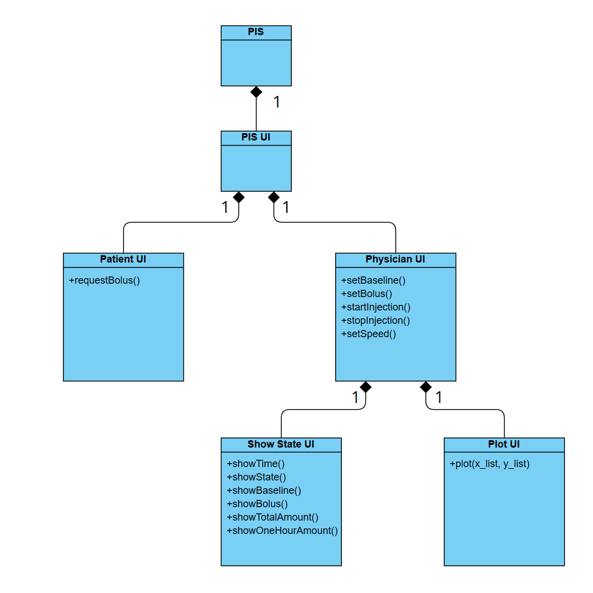

# Traceability

##  Table of Contents

1. [System Architecture](#system-architecture)
2. [Software Traceability](#software-traceability)

## System Architecture
The system architecture is shown below:

## Software Traceability

<table>
    <tr>
        <td></td> 
        <td>Is Implemented By</td> 
        <td>Is Validated By</td> 
    </tr>
    <tr>
  		<td>R1 (Patient UI)</td> 
        <td>S1, S1.1</td> 
        <td>T1.1.1, T2.1, T3.6, T3.7, T3.8</td> 
    </tr>
    <tr>
        <td>R1.1</td> 
        <td>S1.1</td> 
        <td>T1.1.1, T2.1, T3.6, T3.7, T3.8</td> 
    </tr>
    <tr>
        <td>R1.1.1</td> 
        <td>S1.1.1</td> 
        <td>T1.1.1, T2.1, T3.6 </td> 
    </tr>
    <tr>
        <td>R1.1.2</td> 
        <td>S2.4.1, S2.4.2</td> 
        <td>T1.1.1, T2.1, T3.7, T3.8</td> 
    </tr>
    <tr>
        <td>R2 (Physician UI)</td> 
        <td>S2.1, S2.2, S2.3, S2.4, S2.5</td> 
        <td>T1.2.3, T1.2.4, T1.2.5, T1.2.6, T1.3.1, T1.3.2, T2.1, T3.1, T3.2, T3.3, T3.4, T3.5, T3.6, T3.7, T3.8, T3.9, T3.10, T1.4.1, T1.4.2, T1.4.3, T1.4.4, T1.4.5, T1.4.6, T1.4.7, T1.5.1</td> 
    </tr>
    <tr>
        <td>R2.1</td> 
        <td>S2.1.1, S2.1.2, S2.1.3, S2.2.1, S2.2.2, S2.2.3, S2.3.1, S2.4.1, S2.4.2, S2.5.1</td> 
        <td>T1.2.3, T1.2.4, T1.2.5, T1.3.1, T2.1, T3.1, T3.2, T3.3, T3.4, T3.5, T3.6, T3.7, T3.8, T3.9, T3.10</td> 
    </tr>
    <tr>
        <td>R2.1.1</td> 
        <td>S2.4.1, S2.4.2</td> 
        <td>T1.2.4, T2.1, T3.5, T3.6, T3.7, T3.8, T3.9, T3.10</td> 
    </tr>
    <tr>
        <td>R2.1.2</td> 
        <td>S2.5.1</td> 
        <td>T1.2.5, T2.1, T3.5, T3.6, T3.7, T3.9</td> 
    </tr>
    <tr>
        <td>R2.1.3</td> 
        <td>S2.1.1, S2.1.2, S2.1.3</td> 
        <td>T1.3.1, T2.1, T3.1, T3.2</td> 
    </tr>
    <tr>
        <td>R2.1.4</td> 
        <td>S2.2.1, S2.2.2, S2.2.3</td> 
        <td>T1.3.1, T2.1, T3.3, T3.4</td> 
    </tr>
    <tr>
        <td>R2.1.5</td> 
        <td>S2.3.1</td> 
        <td>T1.2.3, T2.1</td> 
    </tr>
    <tr>
        <td>R2.2</td> 
        <td>S2.1.2, S2.2.2, S2.4.2</td> 
        <td>T1.2.6, T1.3.1, T2.1, T3.1, T3.5, T3.6, T3.7, T3.8, T3.9, T3.10</td> 
    </tr>
    <tr>
        <td>R2.2.1</td> 
        <td>S2.1.2</td> 
        <td>T1.3.1, T3.1, T3.5, T3.6, T3.7, T3.8, T3.9, T3.10</td> 
    </tr>
    <tr>
        <td>R2.2.2</td> 
        <td>S2.2.2</td> 
        <td>T1.3.1, T3.3, T3.5, T3.6, T3.7, T3.8, T3.9, T3.10</td> 
    </tr>
    <tr>
        <td>R2.2.3</td> 
        <td>S2.4.2</td> 
        <td>T1.2.6, T2.1</td> 
    </tr>
    <tr>
        <td>R2.2.4</td> 
        <td>S2.4.2</td> 
        <td>T1.2.6, T2.1</td> 
    </tr>
    <tr>
        <td>R2.3</td> 
        <td>S2.1.3, S2.2.3, S2.4.1, S2.4.2</td> 
        <td>T1.2.6, T1.3.2, T2.1, T3.5, T3.6, T3.7, T3.8, T3.9, T3.10</td> 
    </tr>
    <tr>
        <td>R2.3.1</td> 
        <td>S2.1.3, S2.4.1, S2.4.2</td> 
        <td>T1.2.6, T1.3.2, T2.1, T3.5, T3.6, T3.7, T3.8, T3.9, T3.10</td> 
    </tr>
    <tr>
        <td>R2.3.2</td> 
        <td>S2.2.3, S2.4.1, S2.4.2</td> 
        <td>T1.2.6, T1.3.2, T3.6</td> 
    </tr>
    <tr>
        <td>R2.4</td> 
        <td>S2.1.3, S2.2.3, S2.3.1, S2.4.1, S2.4.2</td> 
        <td>T1.2.3, T1.2.6, T1.3.1, T1.3.2, T1.4.1, T1.4.2, T1.4.3, T1.4.4, T1.4.5, T1.4.6, T1.4.7, T1.5.1, T2.1, T3.1, T3.3</td> 
    </tr>
    <tr>
        <td>R2.4.1</td> 
        <td>S2.1.3, S2.4.1, S2.4.2</td> 
        <td>T1.2.6, T1.3.1, T1.3.2, T1.4.2, T2.1, T3.1</td> 
    </tr>
    <tr>
        <td>R2.4.2</td> 
        <td>S2.3.1, S2.4.1, S2.4.2</td> 
        <td>T1.2.3, T1.2.6, T1.4.1, T2.1</td> 
    </tr>
    <tr>
        <td>R2.4.3</td> 
        <td>S2.2.3, S2.4.1, S2.4.2</td> 
        <td>T1.2.6, T1.3.1, T1.3.2, T1.4.3, T2.1, T3.3</td> 
    </tr>
    <tr>
        <td>R2.4.4</td> 
        <td>S2.4.2</td> 
        <td>T1.4.4, T2.1</td> 
    </tr>
    <tr>
        <td>R2.4.5</td> 
        <td>S2.4.2</td> 
        <td>T1.4.6, T2.1</td> 
    </tr>
    <tr>
        <td>R2.4.6</td> 
        <td>S2.4.2</td> 
        <td>T1.4.5, T2.1</td> 
    </tr>
    <tr>
        <td>R2.4.7</td> 
        <td>S2.4.2</td> 
        <td>T1.4.7, T2.1</td> 
    </tr>
    <tr>
        <td>R2.4.8</td> 
        <td>S2.4.2</td> 
        <td>T1.5.1, T2.1</td> 
    </tr>
    <tr>
        <td>R2.5</td> 
        <td>S2.4.1</td> 
        <td>T1.2.4, T2.1</td> 
    </tr>
    <tr>
        <td>R2.5.1</td> 
        <td>S2.4.1</td> 
        <td>T1.2.4, T2.1</td> 
    </tr>
    <tr>
        <td>R2.5.2</td> 
        <td>S2.4.1</td> 
        <td>T1.2.4, T2.1</td> 
    </tr>
    <tr>
        <td>R2.5.3</td> 
        <td>S2.4.1</td> 
        <td>T1.2.4, T2.1</td> 
    </tr>
</table>