

# UserManual document

##  Table of Contents

1. [System Architecture](#system-architecture)
2. [Patient UI](#patient-ui)
    + [Request Bolus](#request-bolus)
3. [Physician UI](#physician-ui)
    + [Set Baseline Rate](#set-baseline-rate)
    + [Set Bolus Rate](#set-bolus-rate)
    + [Start Injection](#start-injection)
    + [Stop Injection](#stop-injection)
    + [Simulating TimeScaling](#simulating-timescaling)

## System Architecture
The system architecture is shown below:

## Patient UI
This is how the user interface for patient shows when the PIS is activated:
<!-- 添加patient-ui图 -->

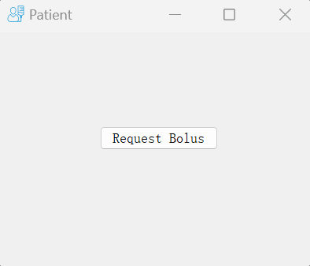

### Request Bolus
Every time "Request Bolus" button can be pressed, but only after the injection is started, bolus will be injected with baseline together if both the amount limit in one hour and in one day is not reached after that injection. Otherwise, there will be nothing happening.
<!-- 添加patient-ui图 -->

## Physician UI
This is how the user interface for physician shows when the PIS is activated:
<!-- 添加physician-ui图 -->

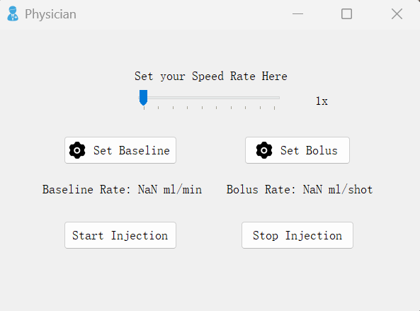

### Set Baseline Rate
Users (Physicians) can set baseline rate with "Set Baseline" button. After pressing the "Set Baseline" button, a new window named "Baseline Rate Setting" will pop up as follows:
<!-- 添加 set baseline rate ui图 -->

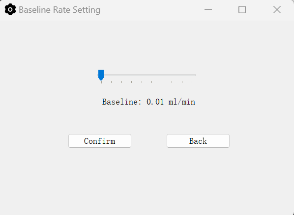

Users can move the related slider to set the baseline rate. Users can press the "Back" button to return to the Physician UI and no baseline rate would be set. After setting the baseline rate, users can press the "Confirm" button to confirm the baseline rate, then an information message box will pop up as follows and tell the users that the baseline rate is set successfully: 
<!-- 添加 set baseline rate successful 图 -->

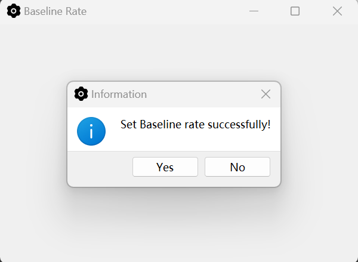

### Set Bolus Rate
Users (Physicians) can set bolus rate with "Set Bolus" button. After pressing the "Set Bolus" button, a new window named "Bolus Rate Setting" will pop up and as follows, which is similar to the situation of setting baseline rate:
<!-- 添加 set bolus rate ui图 -->

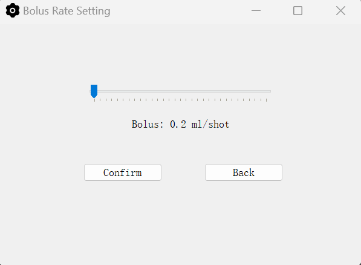

Users can move the slider to set the bolus rate. Users can press the "Back" button to return to the Physician UI and no bolus rate would be set. After setting the bolus rate, users can press the "Confirm" button to confirm the bolus rate, then an information message box will pop up as follows and tell the users that the bolus rate is set successfully: 
<!-- 添加 set bolus rate successful 图 -->

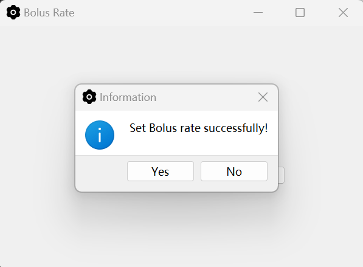

### Start Injection
Users (Physicians) can start baseline injection by pressing "Start Injection" button, but there are some special circumstances that it will fail to start baseline injection: if Users forget to set at least one of the baseline rate and the bolus rate, the PIS would fail to start injection, and a warning message box will pop up: 
<!-- 添加 warning 图 -->

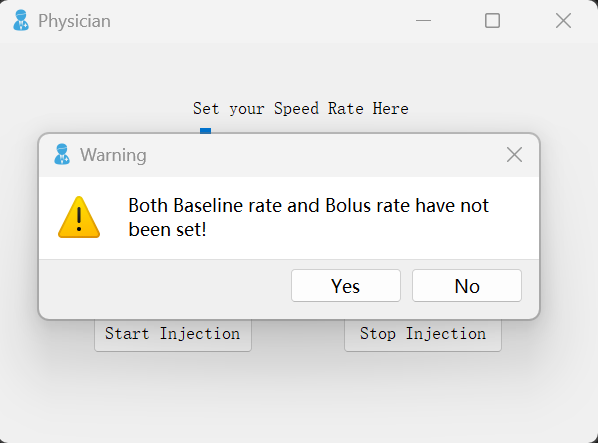

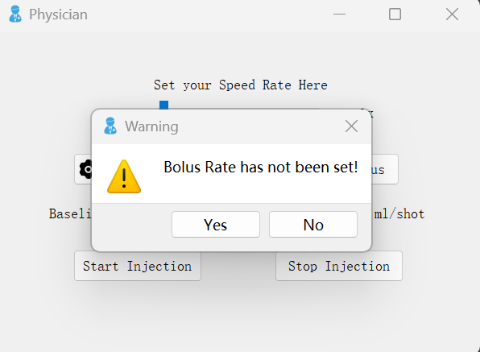

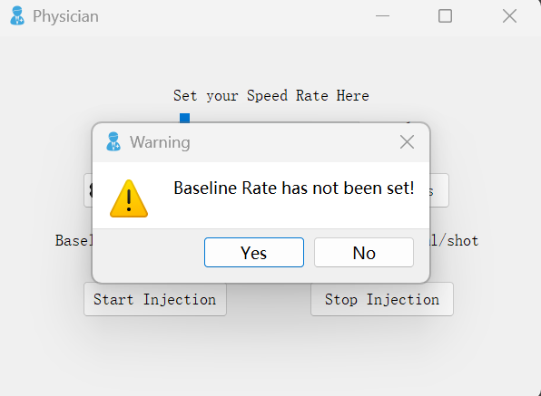

Besides these circumstances, namely both the baseline rate and bolus rate are set before the "Start Injection" button is pressed, after pressing "Start Injection" button, then it will happen that the PIS begins to inject the painkiller, three buttons including "Start Injection" button, "Set Baseline" button and "Set Bolus" button are locked and cannot be pressed. 

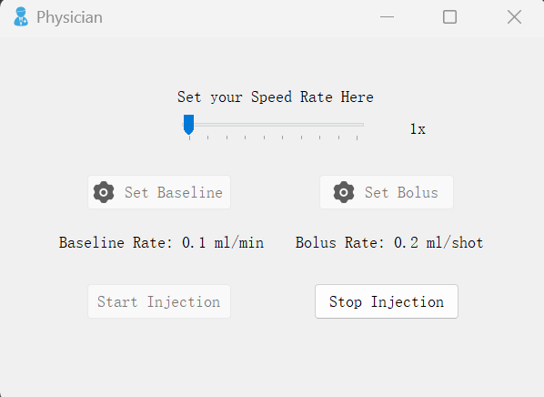

Also after starting injection, a text browser UI window appears showing some information and a display UI window appears showing the real-time injection amount in one day: 
<!-- 添加 text browser 图 -->

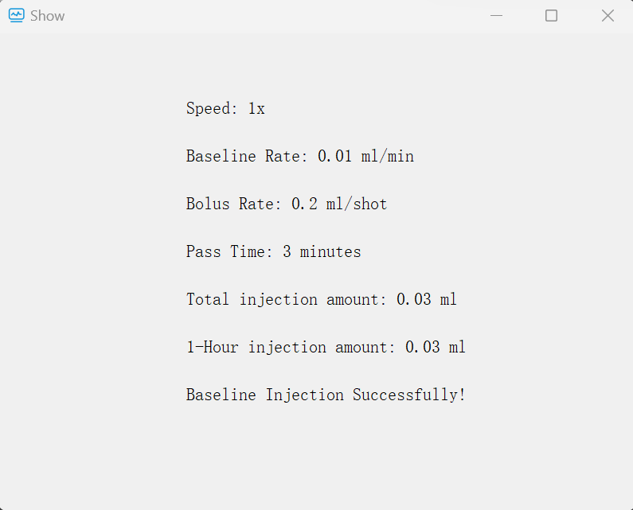

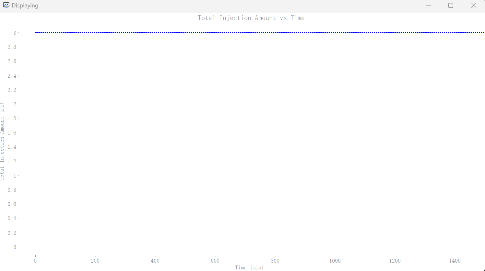

The PIS will inject successfully if both of the amount in one day and amount in one hour don't reach their limit respectively. If at least one of the amounts are over the limit, the PIS will automatically stop the baseline injection and "Over 1-hour Limit, Injection Failed!" or "Over 1-day Limit, Injection Failed!" respectively will show on the text browser UI window.
<!-- 添加 text browser 图 -->

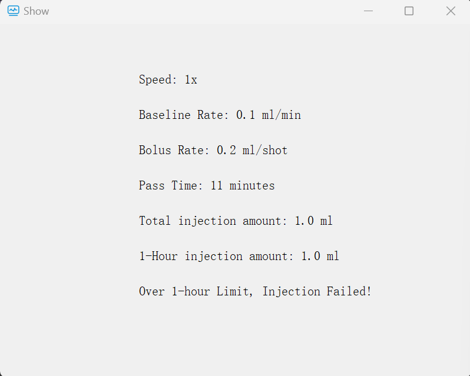

<!-- 添加 text browser 图 -->

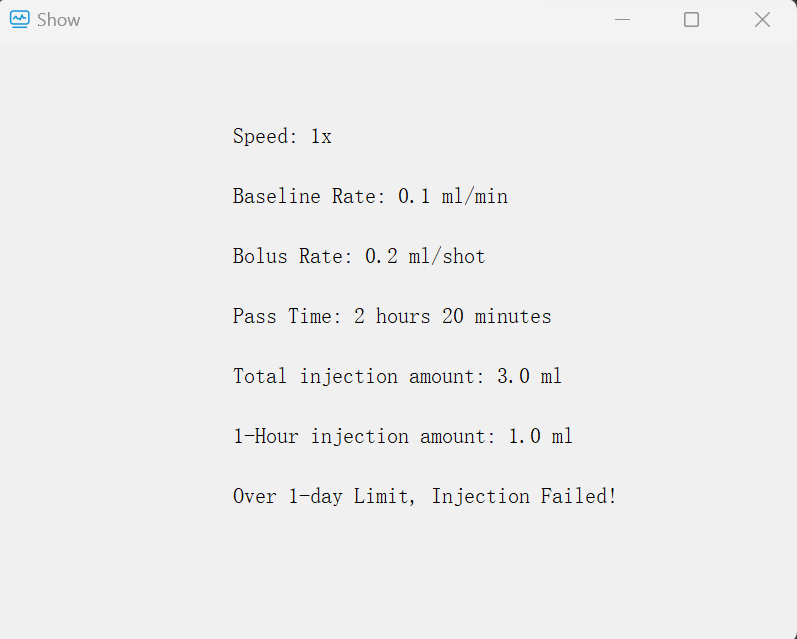

### Stop Injection
Users (Physicians) can stop baseline injection by pressing "Stop Injection" button, after which the PIS will stop injecting. It's important to note that when the baseline injection is stopped, the simulating time will not pause and will elapse continuously. After stopping baseline injection, Users can reset baseline rate and bolus rate and restart the baseline injection through pressing the related button.

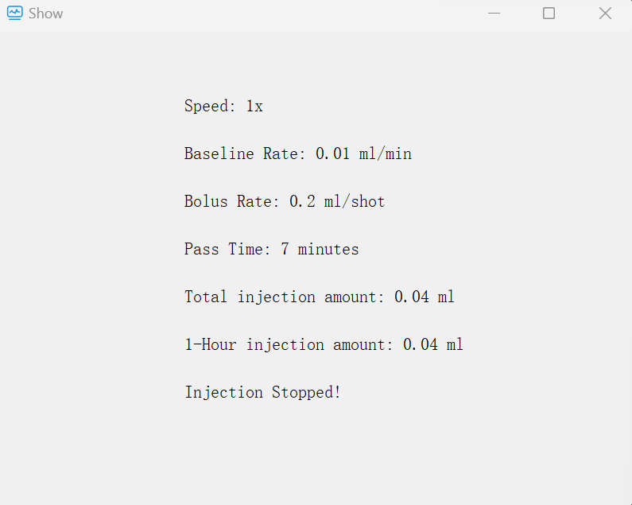

### Simulating TimeScaling
As for a convenient demo display, a "speedRateSlider" slider which is labelled "Set your Speed Rate Here" is located at the top of the Physician UI to control the simulating speed of time:
<!-- 添加 physician ui 图 -->

The origin speed is that 1 second in real world equals to 1 minute in simulating. Users can speed up to most 10 times of the origin speed to show the effect. Just drag the slider to the wanted speed and the speed will be shown on the right. The slider can be dragged every time. Users can hover the mouse over the slider and the label above to get the specified information as "n Speed Rate means 1 second in real world equals to n minutes in simulated time".