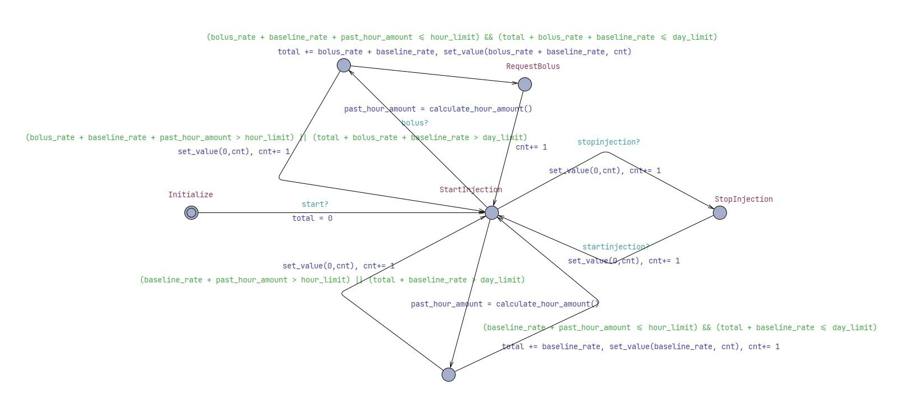
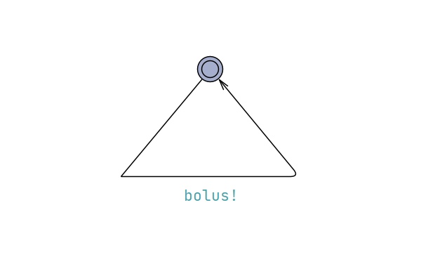
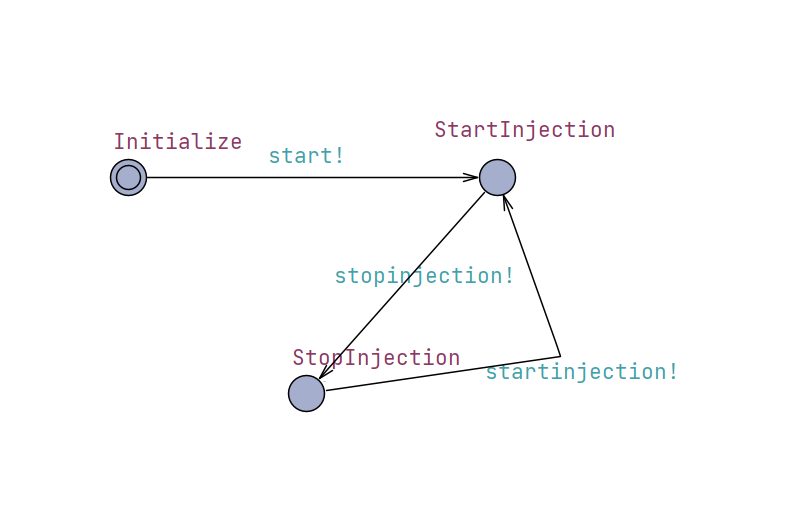
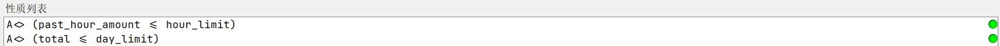

<style>
  table {
    width: 100%;
    border-collapse: collapse;
    table-layout: fixed;
  }
  th, td {
    width: 25%;
    border: 1px solid black;
    padding: 8px;
    text-align: left;
  }
</style>


# Validation

##  Table of Contents

1. [Unit Test](#unit-test)
    + [1.1 Patient UI](#11-patient-ui)
        + [1.1.1 requestBolus](#111-requestbolus)
    + [1.2 Physician UI](#12-physician-ui)
        + [1.2.1 setBaseline](#121-setbaseline)
        + [1.2.2 setBolus](#121-setbolus)
        + [1.2.3 speed_changed](#123-speed_changed)
        + [1.2.4 startInjection](#124-startinjection)
        + [1.2.5 stopInjection](#125-stopinjection)
        + [1.2.6 time_update](#126-time_update)
    + [1.3 Set Rate](#13-set-rate)
        + [1.3.1 rate_changed](#131-rate_changed)
        + [1.3.2 func_confirm](#132-func_confirm)
        + [1.3.3 func_back](#133-func_back)
    + [1.4 Text Browser](#14-text-browser)
        + [1.4.1 Show Speed](#141-show-speed)
        + [1.4.2 Show Baseline](#142-show-baseline)
        + [1.4.3 Show Bolus](#142-show-bolus)
        + [1.4.4 Show Time](#144-show-time)
        + [1.4.5 Show Amount](#145-show-amount)
        + [1.4.6 Show Short Period](#146-show-short-period)
        + [1.4.7 Show State](#147-show-state)
2. [Integration Test](#integration-test)
    + [2.1 Physician UI + Patient UI](#21-physician-ui--patient-ui)
3. [Functionality Test](#functionality-test)
    + [Use Case T3.1](#use-case-t31)
    + [Use Case T3.2](#use-case-t32)
    + [Use Case T3.3](#use-case-t33)
    + [Use Case T3.4](#use-case-t34)
    + [Use Case T3.5](#use-case-t35)
    + [Use Case T3.6](#use-case-t36)
    + [Use Case T3.7](#use-case-t37)
    + [Use Case T3.8](#use-case-t38)
    + [Use Case T3.9](#use-case-t39)
    + [Use Case T3.10](#use-case-t310)
4. [Model Checking](#model-checking)
    + [T4.1 The Painkiller Injection System Model](#t41-the-painkiller-injection-system-model)
    + [T4.2 Patient Model](#t42-patient-model)
    + [T4.3 Physician Model](#t43-physician-model)
    + [T4.4 Properties Checking](#t44-properties-checking)


## Unit Test
This section provides information of unit tests we made for every function with statement coverage, branch coverage and condition coverage criteria. Testing cases with runnable test functions are provided in every test, you can find in corresponding files.

### 1.1 Patient UI
#### 1.1.1 requestBolus
```py
def requestBolus(self):
    global GlobalValue
    if GlobalValue.isStop == False: # Tcover1.1.1.1
        GlobalValue.flag_bolus = True
    else: # Tcover1.1.1.2
        return
```
+ Coverage Criteria: Branch coverage
+ Test Function: test/unit.py/test_patient_ui_requestBolus1 and test/unit.py/test_patient_ui_requestBolus2
+ Test Case
<table>
    <tr>
        <td></td> 
        <td>Test Case T1.1.1.1</td> 
        <td>Test Case T1.1.1.2</td> 
    </tr>
    <tr>
  		<td>Input</td> 
        <td>------</td> 
        <td>------</td> 
    </tr>
    <tr>
        <td>Coverage Item</td> 
        <td>Tcover 1.1.1.1</td> 
        <td>Tcover 1.1.1.2</td> 
    </tr>
    <tr>
        <td>State</td> 
        <td>Press the "Request Bolus" button; GlobalValue.isStop == True</td> 
        <td>Press the "Request Bolus" button; GlobalValue.isStop == False</td> 
    </tr>
    <tr>
        <td>Expected Output</td> 
        <td>GlobalValue.flag_bolus == False</td> 
        <td>GlobalValue.flag_bolus == True</td> 
    </tr>
    <tr>
        <td>Test Result</td> 
        <td>Passed</td> 
        <td>Passed</td> 
    </tr>
</table>

+ Test Coverage: 2/2 = 100%

### 1.2 Physician UI
#### 1.2.1 setBaseline
```py
def setBaseline(self):
    self.baselineRateText.window.show() # Statement Tcover1.2.1.1
```
+ Coverage Criteria: Statement coverage
+ Test Function: test/unit.py/test_physician_ui_set_baseline
+ Test Case
<table>
    <tr>
        <td></td> 
        <td>Test Case T1.2.1.1</td> 
    </tr>
    <tr>
  		<td>Input</td> 
        <td>------</td> 
    </tr>
    <tr>
        <td>Coverage Item</td> 
        <td>Tcover 1.2.1.1</td> 
    </tr>
    <tr>
        <td>State</td> 
        <td>Press the "Set Baseline" button</td> 
    </tr>
    <tr>
        <td>Expected Output</td> 
        <td>A new window named "Baseline Rate" will pop up</td> 
    </tr>
    <tr>
        <td>Test Result</td> 
        <td>Passed</td> 
    </tr>
</table>

+ Test Coverage: 1/1 = 100%

#### 1.2.2 setBolus
```py
def setBolus(self):
    self.bolusRateText.window.show() # Statement Tcover1.2.2.1
```
+ Coverage Criteria: Statement coverage
+ Test Function: test/unit.py/test_physician_ui_set_bolus
+ Test Case
<table>
    <tr>
        <td></td> 
        <td>Test Case T1.2.2.1</td> 
    </tr>
    <tr>
  		<td>Input</td> 
        <td>------</td> 
    </tr>
    <tr>
        <td>Coverage Item</td> 
        <td>Tcover 1.2.2.1</td> 
    </tr>
    <tr>
        <td>State</td> 
        <td>Press the "Set Bolus" button</td> 
    </tr>
    <tr>
        <td>Expected Output</td> 
        <td>A new window named "Bolus Rate Setting" will pop up</td> 
    </tr>
    <tr>
        <td>Test Result</td> 
        <td>Passed</td> 
    </tr>
</table>

+ Test Coverage: 1/1 = 100%

#### 1.2.3 speed_changed
```py
def speed_changed(self):
    global GlobalValue # Statement Tcover1.2.3.1
    GlobalValue.speed = self.speedRateSlider.value() 
    self.speedRateLabel2.setText(str(GlobalValue.speed) + "x")
    self.textBrowser.ShowSpeed()
    self.myTimer.setInterval(int(1000 / GlobalValue.speed))
```
+ Coverage Criteria: Statement coverage
+ Test Function: test/unit.py/test_physician_ui_speed
+ Test Case
<table>
    <tr>
        <td></td> 
        <td>Test Case T1.2.3.1</td> 
    </tr>
    <tr>
  		<td>Input</td> 
        <td>------</td> 
    </tr>
    <tr>
        <td>Coverage Item</td> 
        <td>Tcover 1.2.3.1</td> 
    </tr>
    <tr>
        <td>State</td> 
        <td>Drag the "Set Speed" slider</td> 
    </tr>
    <tr>
        <td>Expected Output</td> 
        <td>Store the speed according to the value from the slider; At the right side of the slider, it shows the speed value; Set the interval of the Timer according to the speed. </td> 
    </tr>
    <tr>
        <td>Test Result</td> 
        <td>Passed</td> 
    </tr>
</table>

+ Test Coverage: 1/1 = 100%

#### 1.2.4 startInjection
```py
def startInjection(self):
    global GlobalValue
    if (GlobalValue.RT_bolus_rate < GlobalValue.minBolusRate or GlobalValue.RT_bolus_rate > GlobalValue.maxBolusRate) and (GlobalValue.RT_baseline_rate < GlobalValue.minBaselineRate or GlobalValue.RT_baseline_rate > GlobalValue.maxBaselineRate): # Branch Tcover1.2.4.1
        QMessageBox.warning(self.window, "Warning", "Both Baseline rate and Bolus rate have not been set!", QMessageBox.Yes | QMessageBox.No, QMessageBox.Yes)
        return
    elif (GlobalValue.RT_bolus_rate < GlobalValue.minBolusRate or GlobalValue.RT_bolus_rate > GlobalValue.maxBolusRate) and (GlobalValue.RT_baseline_rate >= GlobalValue.minBaselineRate and GlobalValue.RT_baseline_rate <= GlobalValue.maxBaselineRate): # Branch Tcover1.2.4.2
        QMessageBox.warning(self.window, "Warning", "Bolus Rate has not been set!", QMessageBox.Yes | QMessageBox.No, QMessageBox.Yes)
        return
    elif (GlobalValue.RT_bolus_rate >= GlobalValue.minBolusRate and GlobalValue.RT_bolus_rate <= GlobalValue.maxBolusRate) and (GlobalValue.RT_baseline_rate < GlobalValue.minBaselineRate or GlobalValue.RT_baseline_rate > GlobalValue.maxBaselineRate): # Branch Tcover1.2.4.3
        QMessageBox.warning(self.window, "Warning", "Baseline Rate has not been set!", QMessageBox.Yes | QMessageBox.No, QMessageBox.Yes)
        return
    else: # Branch Tcover1.2.4.4
        self.button_startInjection.setEnabled(False)
        self.button_setBaseline.setEnabled(False)
        self.button_setBolus.setEnabled(False)
        self.textBrowser.window.show()
        self.figurePlot.window.show()
        GlobalValue.isStop = False
        self.stop = False
        self.myTimer.start(int(1000 / GlobalValue.speed))
```
+ Coverage Criteria: Statement coverage
+ Test Function: test/unit.py/test_physician_ui_start_injection1, test/unit.py/test_physician_ui_start_injection2, test/unit.py/test_physician_ui_start_injection3, test/unit.py/test_physician_ui_start_injection4
+ Test Case
<table>
    <tr>
        <td></td> 
        <td>Test Case T1.2.4.1</td> 
        <td>Test Case T1.2.4.2</td> 
        <td>Test Case T1.2.4.3</td> 
        <td>Test Case T1.2.4.4</td> 
    </tr>
    <tr>
  		<td>Input</td> 
        <td>------</td> 
        <td>------</td> 
        <td>------</td> 
        <td>------</td> 
    </tr>
    <tr>
        <td>Coverage Item</td> 
        <td>Tcover 1.2.4.1</td> 
        <td>Tcover 1.2.4.2</td> 
        <td>Tcover 1.2.4.3</td> 
        <td>Tcover 1.2.4.4</td> 
    </tr>
    <tr>
        <td>State</td> 
        <td>GlobalValue.RT_baseline_rate = GlobalValue.maxBaselineRate + 0.1; GlobalValue.RT_bolus_rate = GlobalValue.maxBolusRate + 0.1</td> 
        <td>GlobalValue.RT_baseline_rate = GlobalValue.minBaselineRate; GlobalValue.RT_bolus_rate = GlobalValue.maxBolusRate + 0.1</td> 
        <td>GlobalValue.RT_baseline_rate = GlobalValue.maxBaselineRate + 0.1; GlobalValue.RT_bolus_rate = GlobalValue.minBolusRate</td> 
        <td>GGlobalValue.RT_baseline_rate = GlobalValue.minBaselineRate; GlobalValue.RT_bolus_rate = GlobalValue.minBolusRate</td> 
    </tr>
    <tr>
        <td>Expected Output</td> 
        <td>A new window named "warning" will pop up; Fail to start injection</td> 
        <td>A new window named "warning" will pop up; Fail to start injection</td> 
        <td>A new window named "warning" will pop up; Fail to start injection</td> 
        <td>Succeed to start injection; "Start Injection" button, "Set Baseline" button and "Set Bolus" button cann't be pressed; GlobalValue.isStop == False; stop == False</td> 
    </tr>
    <tr>
        <td>Test Result</td> 
        <td>Passed</td> 
        <td>Passed</td> 
        <td>Passed</td> 
        <td>Passed</td> 
    </tr>
</table>

+ Test Coverage: 4/4 = 100%

#### 1.2.5 stopInjection
```py
def stopInjection(self):
    self.stop = True # Statement Tcover1.2.5.1
    GlobalValue.isStop = True
    self.button_startInjection.setEnabled(True)
    self.button_setBaseline.setEnabled(True)
    self.button_setBolus.setEnabled(True)
```
+ Coverage Criteria: Statement coverage
+ Test Function: test/unit.py/test_physician_ui_stop_injection
+ Test Case
<table>
    <tr>
        <td></td> 
        <td>Test Case T1.2.5.1</td> 
    </tr>
    <tr>
  		<td>Input</td> 
        <td>------</td> 
    </tr>
    <tr>
        <td>Coverage Item</td> 
        <td>Tcover 1.2.5.1</td> 
    </tr>
    <tr>
        <td>State</td> 
        <td>Press the "Stop Injection" button</td> 
    </tr>
    <tr>
        <td>Expected Output</td> 
        <td>"Start Injection" button, "Set Baseline" button and "Set Bolus" button can be pressed; GlobalValue.isStop == True; stop == True </td> 
    </tr>
    <tr>
        <td>Test Result</td> 
        <td>Passed</td> 
    </tr>
</table>

+ Test Coverage: 1/1 = 100%

#### 1.2.6 time_update
```py
def time_update(self):
    global GlobalValue
    if self.stop == False: # Branch Tcover1.2.6.1
        RT_short_period_injection_amount = float(0)
        RT_one_day_injection_amount = float(0)
        self.second += 1
        self.textBrowser.ShowTime(str(self.second))
        if GlobalValue.flag_bolus == False: # Branch Tcover1.2.6.2
            
            if GlobalValue.q.qsize() == 60: # Branch Tcover1.2.6.3
                GlobalValue.q.get()

            if GlobalValue.q_day.qsize() == 1440: # Branch Tcover1.2.6.4
                GlobalValue.q_day.get()
                GlobalValue.day_amount_queue.get()
                GlobalValue.time_queue.get()

            GlobalValue.RT_injection_amount = round(GlobalValue.RT_injection_amount + GlobalValue.RT_baseline_rate,2)

            RT_short_period_injection_amount = round(RT_short_period_injection_amount + GlobalValue.RT_baseline_rate,2)
            RT_one_day_injection_amount = round(RT_one_day_injection_amount + GlobalValue.RT_baseline_rate,2)
            queueList = list(GlobalValue.q.queue)
            q_dayList = list(GlobalValue.q_day.queue)
            
            for i in range(len(queueList)): 
                RT_short_period_injection_amount = round(RT_short_period_injection_amount + queueList[i],2)

            for i in range(len(q_dayList)): 
                RT_one_day_injection_amount = round(RT_one_day_injection_amount + q_dayList[i],2)
            
            if RT_short_period_injection_amount > GlobalValue.short_period_amount_limit or RT_one_day_injection_amount > GlobalValue.total_amount_limit: # Branch Tcover1.2.6.5
                if RT_short_period_injection_amount > GlobalValue.short_period_amount_limit: # Branch Tcover1.2.6.6
                    self.textBrowser.ShowState("injection_failed")
                if RT_one_day_injection_amount > GlobalValue.total_amount_limit: # Branch Tcover1.2.6.7
                    self.textBrowser.ShowState("Towards total amount") 
                GlobalValue.RT_injection_amount = round(GlobalValue.RT_injection_amount - GlobalValue.RT_baseline_rate,2)
                RT_short_period_injection_amount = round(RT_short_period_injection_amount - GlobalValue.RT_baseline_rate,2)
                RT_one_day_injection_amount = round(RT_one_day_injection_amount - GlobalValue.RT_baseline_rate,2)
                GlobalValue.q.put(float(0))
                GlobalValue.q_day.put(float(0))
                GlobalValue.day_amount_queue.put(RT_one_day_injection_amount)
                GlobalValue.time_queue.put(self.second)
            else: # Branch Tcover1.2.6.8
                GlobalValue.q.put(GlobalValue.RT_baseline_rate)
                GlobalValue.q_day.put(GlobalValue.RT_baseline_rate)
                GlobalValue.day_amount_queue.put(RT_one_day_injection_amount)
                GlobalValue.time_queue.put(self.second)
                self.textBrowser.ShowState("baseline_injection_success")

            q_day_amount_queue_list = list(GlobalValue.day_amount_queue.queue)
            q_time_queue_list = list(GlobalValue.time_queue.queue)
            self.figurePlot.show_graph(q_time_queue_list, q_day_amount_queue_list)
            self.textBrowser.ShowAmount(str(RT_one_day_injection_amount))
            self.textBrowser.ShowShortPeriod(str(RT_short_period_injection_amount))

        else: # Branch Tcover1.2.6.9
            GlobalValue.flag_bolus = False

            if GlobalValue.q.qsize() == 60: # Branch Tcover1.2.6.10
                GlobalValue.q.get()

            if GlobalValue.q_day.qsize() == 1440: # Branch Tcover1.2.6.11
                GlobalValue.q_day.get()
                GlobalValue.day_amount_queue.get()
                GlobalValue.time_queue.get()

            GlobalValue.RT_injection_amount = round(GlobalValue.RT_injection_amount + GlobalValue.RT_baseline_rate + GlobalValue.RT_bolus_rate,2)

            RT_short_period_injection_amount = round(RT_short_period_injection_amount + GlobalValue.RT_baseline_rate + GlobalValue.RT_bolus_rate,2)
            RT_one_day_injection_amount = round(RT_one_day_injection_amount + GlobalValue.RT_baseline_rate + GlobalValue.RT_bolus_rate,2)
            queueList = list(GlobalValue.q.queue)
            q_dayList = list(GlobalValue.q_day.queue)
            
            for i in range(len(queueList)): 
                RT_short_period_injection_amount = round(RT_short_period_injection_amount + queueList[i],2)

            for i in range(len(q_dayList)): 
                RT_one_day_injection_amount = round(RT_one_day_injection_amount + q_dayList[i],2)
            

            if RT_short_period_injection_amount > GlobalValue.short_period_amount_limit or RT_one_day_injection_amount > GlobalValue.total_amount_limit: # Branch Tcover1.2.6.12
                if RT_short_period_injection_amount > GlobalValue.short_period_amount_limit: # Branch Tcover1.2.6.13
                    self.textBrowser.ShowState("injection_failed")
                if RT_one_day_injection_amount > GlobalValue.total_amount_limit: # Branch Tcover1.2.6.14
                    self.textBrowser.ShowState("Towards total amount")
                GlobalValue.RT_injection_amount = round(GlobalValue.RT_injection_amount - (GlobalValue.RT_baseline_rate + GlobalValue.RT_bolus_rate),2)
                RT_short_period_injection_amount = round(RT_short_period_injection_amount - (GlobalValue.RT_baseline_rate + GlobalValue.RT_bolus_rate),2)
                RT_one_day_injection_amount = round(RT_one_day_injection_amount - (GlobalValue.RT_baseline_rate + GlobalValue.RT_bolus_rate),2)
                GlobalValue.q.put(float(0))
                GlobalValue.q_day.put(float(0))
                GlobalValue.day_amount_queue.put(RT_one_day_injection_amount)
                GlobalValue.time_queue.put(self.second)
                
            else: # Branch Tcover1.2.6.15
                GlobalValue.q.put(GlobalValue.RT_baseline_rate + GlobalValue.RT_bolus_rate)
                GlobalValue.q_day.put(GlobalValue.RT_baseline_rate + GlobalValue.RT_bolus_rate)
                GlobalValue.day_amount_queue.put(RT_one_day_injection_amount)
                GlobalValue.time_queue.put(self.second)
                self.textBrowser.ShowState("bolus_injection_success")

            q_day_amount_queue_list = list(GlobalValue.day_amount_queue.queue)
            q_time_queue_list = list(GlobalValue.time_queue.queue)
            self.figurePlot.show_graph(q_time_queue_list, q_day_amount_queue_list)
            self.textBrowser.ShowAmount(str(RT_one_day_injection_amount))
            self.textBrowser.ShowShortPeriod(str(RT_short_period_injection_amount))
            
    else: # Branch Tcover1.2.6.16
        RT_short_period_injection_amount = float(0)
        RT_one_day_injection_amount = float(0)
        self.second += 1
        self.textBrowser.ShowTime(str(self.second))
        if GlobalValue.q.qsize() == 60: # Branch Tcover1.2.6.17
            GlobalValue.q.get()
            
        if GlobalValue.q_day.qsize() == 1440: # Branch Tcover1.2.6.18
            GlobalValue.q_day.get()
            GlobalValue.day_amount_queue.get()
            GlobalValue.time_queue.get()

        queueList = list(GlobalValue.q.queue)
        q_dayList = list(GlobalValue.q_day.queue)
        
        for i in range(len(queueList)): 
            RT_short_period_injection_amount = round(RT_short_period_injection_amount + queueList[i],2)
            
        for i in range(len(q_dayList)): 
            RT_one_day_injection_amount = round(RT_one_day_injection_amount + q_dayList[i],2)
        
        GlobalValue.q.put(float(0))
        GlobalValue.q_day.put(float(0))
        GlobalValue.day_amount_queue.put(RT_one_day_injection_amount)
        GlobalValue.time_queue.put(self.second)
        self.textBrowser.ShowState("stop injection")

        q_day_amount_queue_list = list(GlobalValue.day_amount_queue.queue)
        q_time_queue_list = list(GlobalValue.time_queue.queue)
        self.figurePlot.show_graph(q_time_queue_list, q_day_amount_queue_list)
        self.textBrowser.ShowAmount(str(RT_one_day_injection_amount))
        self.textBrowser.ShowShortPeriod(str(RT_short_period_injection_amount))
```
+ Coverage Criteria: Branch coverage
+ Test Function: test/unit.py/test_physician_ui_time_update1 to test/unit.py/test_physician_ui_time_update8
+ Test Case
<table>
    <tr>
        <td></td> 
        <td>Test Case T1.2.6.1</td> 
        <td>Test Case T1.2.6.2</td>
        <td>Test Case T1.2.6.3</td>
        <td>Test Case T1.2.6.4</td>
    </tr>
    <tr>
  		<td>Input</td> 
        <td>------</td> 
        <td>------</td> 
        <td>------</td> 
        <td>------</td> 
    </tr>
    <tr>
        <td>Coverage Item</td> 
        <td>Tcover 1.2.6.1; Tcover 1.2.6.2; Tcover 1.2.6.8</td> 
        <td>Tcover 1.2.6.1; Tcover 1.2.6.2; Tcover 1.2.6.3; Tcover 1.2.6.4; Tcover 1.2.6.5; Tcover 1.2.6.6;</td> 
        <td>Tcover 1.2.6.1; Tcover 1.2.6.2; Tcover 1.2.6.3; Tcover 1.2.6.4; Tcover 1.2.6.5; Tcover 1.2.6.7;</td> 
        <td>Tcover 1.2.6.1; Tcover 1.2.6.9; Tcover 1.2.6.15</td> 
    </tr>
    <tr>
        <td>State</td> 
        <td>GlobalValue.flag_bolus == False; stop == False; GlobalValue.q.qsize() < 60; GlobalValue.q_day.qsize() < 1440; RT_short_period_injection_amount = 0; RT_one_day_injection_amount = 0; </td> 
        <td>GlobalValue.flag_bolus == False; stop == False; GlobalValue.q.qsize() == 60; GlobalValue.q_day.qsize() == 1440; RT_short_period_injection_amount = GlobalValue.short_period_amount_limit; RT_one_day_injection_amount = GlobalValue.short_period_amount_limit < GlobalValue.total_amount_limit; </td> 
        <td>GlobalValue.flag_bolus == False; stop == False; GlobalValue.q.qsize() == 60; GlobalValue.q_day.qsize() == 1440; RT_short_period_injection_amount = 0; RT_one_day_injection_amount = GlobalValue.total_amount_limit; </td> 
        <td>GlobalValue.flag_bolus == True; stop == False; GlobalValue.q.qsize() == 0; GlobalValue.q_day.qsize() == 0; RT_short_period_injection_amount = 0; RT_one_day_injection_amount = 0; </td> 
    </tr>
    <tr>
        <td>Expected Output</td> 
        <td>The state on the window shows "Baseline Injection Successfully!"</td> 
        <td>The state on the window shows "Over 1-hour Limit, Injection Failed!"</td> 
        <td>The state on the window shows "Over 1-day Limit, Injection Failed!"</td> 
        <td>The state on the window shows "Baseline and Bolus Injection Injection Successfully!"</td> 
    </tr>
    <tr>
        <td>Test Result</td> 
        <td>Passed</td> 
        <td>Passed</td> 
        <td>Passed</td> 
        <td>Passed</td> 
    </tr>
    <tr>
        <td></td> 
        <td>Test Case T1.2.6.5</td> 
        <td>Test Case T1.2.6.6</td>
        <td>Test Case T1.2.6.7</td>
        <td>Test Case T1.2.6.8</td>
    </tr>
    <tr>
  		<td>Input</td> 
        <td>------</td> 
        <td>------</td> 
        <td>------</td> 
        <td>------</td> 
    </tr>
    <tr>
        <td>Coverage Item</td> 
        <td>Tcover 1.2.6.1; Tcover 1.2.6.9; Tcover 1.2.6.10; Tcover 1.2.6.11; Tcover 1.2.6.12; Tcover 1.2.6.13</td> 
        <td>Tcover 1.2.6.1; Tcover 1.2.6.9; Tcover 1.2.6.10; Tcover 1.2.6.11; Tcover 1.2.6.12; Tcover 1.2.6.14</td> 
        <td>Tcover 1.2.6.16</td> 
        <td>Tcover 1.2.6.16; Tcover 1.2.6.17; Tcover 1.2.6.18</td> 
    </tr>
    <tr>
        <td>State</td> 
        <td>GlobalValue.flag_bolus == True; stop == False; GlobalValue.q.qsize() == 60; GlobalValue.q_day.qsize() == 1440; RT_short_period_injection_amount = GlobalValue.short_period_amount_limit; RT_one_day_injection_amount = GlobalValue.short_period_amount_limit < GlobalValue.total_amount_limit;</td> 
        <td>GlobalValue.flag_bolus == True; stop == False; GlobalValue.q.qsize() == 60; GlobalValue.q_day.qsize() == 1440; RT_short_period_injection_amount = 0; RT_one_day_injection_amount = GlobalValue.total_amount_limit; </td> 
        <td>stop == True; GlobalValue.q.qsize() == 0; GlobalValue.q_day.qsize() == 0;</td> 
        <td>stop == True; GlobalValue.q.qsize() == 60; GlobalValue.q_day.qsize() == 1440;</td> 
    </tr>
    <tr>
        <td>Expected Output</td> 
        <td>The state on the window shows "Over 1-hour Limit, Injection Failed!"</td> 
        <td>The state on the window shows "Over 1-day Limit, Injection Failed!"</td> 
        <td>The state on the window shows "Injection Stopped!"</td> 
        <td>The state on the window shows "Injection Stopped!"</td> 
    </tr>
    <tr>
        <td>Test Result</td> 
        <td>Passed</td> 
        <td>Passed</td> 
        <td>Passed</td> 
        <td>Passed</td> 
    </tr>
</table>

+ Test Coverage: 18/18 = 100%

### 1.3 Set Rate 
It's an abstract user interface for setting baseline rate and bolus rate.

#### 1.3.1 rate_changed
```py
def rate_changed(self):
    if self.name == "Bolus Rate": # Branch Tcover1.3.1.1
        val = float(self.rateSlider.value()) / float(100)
        self.textLabel.setText("Bolus: " + str(val) + " ml/shot")
        
    if self.name == "Baseline Rate": # Branch Tcover1.3.1.2
        val = float(self.rateSlider.value()) / float(100)
        self.textLabel.setText("Baseline: " + str(val) + " ml/min")
```
+ Coverage Criteria: Branch coverage
+ Test Function: test/unit.py/test_physician_ui_BolusSetRate_rate_changed and test/unit.py/test_physician_ui_BaselineSetRate_rate_changed
+ Test Case
<table>
    <tr>
        <td></td> 
        <td>Test Case T1.3.1.1</td> 
        <td>Test Case T1.3.1.2</td> 
    </tr>
    <tr>
  		<td>Input</td> 
        <td>------</td> 
        <td>------</td> 
    </tr>
    <tr>
        <td>Coverage Item</td> 
        <td>Tcover 1.3.1.1</td> 
        <td>Tcover 1.3.1.2</td> 
    </tr>
    <tr>
        <td>State</td> 
        <td>name == "Bolus Rate"</td> 
        <td>name == "Baseline Rate"</td> 
    </tr>
    <tr>
        <td>Expected Output</td> 
        <td>Store the bolus rate according to the value from the slider; Under the slider, it shows the selected bolus rate;</td> 
        <td>Store the baseline rate according to the value from the slider; At the right side of the slider, it shows the selected baseline rate;</td> 
    </tr>
    <tr>
        <td>Test Result</td> 
        <td>Passed</td> 
        <td>Passed</td> 
    </tr>
</table>

+ Test Coverage: 2/2 = 100%

#### 1.3.2 func_confirm
```py
def func_confirm(self):
        newRate = float(self.rateSlider.value()) / float(100)
        global GlobalValue
        if self.name == "Bolus Rate": # Branch Tcover1.3.2.1
            QMessageBox.information(self.window, "Information", "Set Bolus rate successfully!", QMessageBox.Yes | QMessageBox.No, QMessageBox.Yes)
            GlobalValue.RT_bolus_rate = newRate
            self.textBrowser.ShowBolus()
            self.label.setText("Bolus Rate: " + str(newRate) + " ml/shot")
            self.window.close()
        if self.name == "Baseline Rate": # Branch Tcover1.3.2.2
            QMessageBox.information(self.window, "Information", "Set Baseline rate successfully!", QMessageBox.Yes | QMessageBox.No, QMessageBox.Yes)
            GlobalValue.RT_baseline_rate = newRate
            self.textBrowser.ShowBaseline()
            self.label.setText("Baseline Rate: " + str(newRate) + " ml/min")
            self.window.close()
```
+ Coverage Criteria: Branch coverage
+ Test Function: test/unit.py/test_setstate_bolus_func_confirm and test/unit.py/test_setstate_baseline_func_confirm
+ Test Case
<table>
    <tr>
        <td></td> 
        <td>Test Case T1.3.2.1</td> 
        <td>Test Case T1.3.2.2</td> 
    </tr>
    <tr>
  		<td>Input</td> 
        <td>------</td> 
        <td>------</td> 
    </tr>
    <tr>
        <td>Coverage Item</td> 
        <td>Tcover 1.3.2.1</td> 
        <td>Tcover 1.3.2.2</td> 
    </tr>
    <tr>
        <td>State</td> 
        <td>Press the "Confirm" button on the "Bolus Rate Setting" ui window; name == "Bolus Rate"</td> 
        <td>Press the "Confirm" button on the "Baseline Rate Setting" ui window; name == "Baseline Rate"</td> 
    </tr>
    <tr>
        <td>Expected Output</td> 
        <td>A new Message Box named "Information" which shows "Set Bolus rate successfully!" will pop up. After pressing "Yes" button on the message box, store the bolus rate according to the value from the slider and show the selected bolus rate under the "Set Bolus" button in the "Physician" UI;</td> 
        <td>A new Message Box named "Information" which shows "Set Baseline rate successfully!" will pop up. After pressing "Yes" button on the message box, store the baseline rate according to the value from the slider and show the selected baseline rate under the "Set Baseline" button in the "Physician" UI;</td> 
    </tr>
    <tr>
        <td>Test Result</td> 
        <td>Passed</td> 
        <td>Passed</td> 
    </tr>
</table>

+ Test Coverage: 2/2 = 100%

#### 1.3.3 func_back
```py
def func_back(self):
    self.window.close() # Statement Tcover 1.3.3.1
```
+ Coverage Criteria: Statement coverage
+ Test Function: test/unit.py/test_physician_ui_SetRate_back
+ Test Case
<table>
    <tr>
        <td></td> 
        <td>Test Case T1.3.3.1</td> 
    </tr>
    <tr>
  		<td>Input</td> 
        <td>------</td>
    </tr>
    <tr>
        <td>Coverage Item</td> 
        <td>Tcover 1.3.3.1</td> 
    </tr>
    <tr>
        <td>State</td> 
        <td>Press the "Back" button on the "Bolus Rate Setting" or "Baseline Rate Setting" ui window</td> 
    </tr>
    <tr>
        <td>Expected Output</td> 
        <td>The window would close; No baseline/bolus rate would be set</td> 
    </tr>
    <tr>
        <td>Test Result</td> 
        <td>Passed</td> 
    </tr>
</table>

+ Test Coverage: 1/1 = 100%

### 1.4 Text Browser
The Text Browser is used for showing real-time information after starting injection in a "Show" window.

#### 1.4.1 Show Speed
```py
def ShowSpeed(self):
    global GlobalValue # Statement Tcover1.4.1.1
    self.SpeedStatusBar.showMessage("Speed: " + str(GlobalValue.speed) + "x") 
```
+ Coverage Criteria: Statement coverage
+ Test Function: test/unit.py/test_physician_ui_textBrowser_ShowSpeed
+ Test Case
<table>
    <tr>
        <td></td> 
        <td>Test Case T1.4.1.1</td> 
    </tr>
    <tr>
  		<td>Input</td> 
        <td>------</td>
    </tr>
    <tr>
        <td>Coverage Item</td> 
        <td>Tcover 1.4.1.1</td> 
    </tr>
    <tr>
        <td>State</td> 
        <td>When time update, show the real-time speed on the "Show" ui window</td> 
    </tr>
    <tr>
        <td>Expected Output</td> 
        <td>Show ("Speed: " + str(GlobalValue.speed) + "x") on the "Show" ui window </td> 
    </tr>
    <tr>
        <td>Test Result</td> 
        <td>Passed</td> 
    </tr>
</table>

+ Test Coverage: 1/1 = 100%

#### 1.4.2 Show Baseline
```py
def ShowBaseline(self): 
    global GlobalValue # Statement Tcover1.4.2.1
    self.BaselineStatusBar.showMessage("Baseline Rate: " + str(GlobalValue.RT_baseline_rate) + " ml/min")
```
+ Coverage Criteria: Statement coverage
+ Test Function: test/unit.py/test_physician_ui_textBrowser_ShowBaseline
+ Test Case
<table>
    <tr>
        <td></td> 
        <td>Test Case T1.4.2.1</td> 
    </tr>
    <tr>
  		<td>Input</td> 
        <td>------</td>
    </tr>
    <tr>
        <td>Coverage Item</td> 
        <td>Tcover 1.4.2.1</td> 
    </tr>
    <tr>
        <td>State</td> 
        <td>When time update, show the baseline rate set before on the "Show" ui window</td> 
    </tr>
    <tr>
        <td>Expected Output</td> 
        <td>Show ("Baseline Rate: " + str(GlobalValue.RT_baseline_rate) + " ml/min") on the "Show" ui window</td> 
    </tr>
    <tr>
        <td>Test Result</td> 
        <td>Passed</td> 
    </tr>
</table>

+ Test Coverage: 1/1 = 100%

#### 1.4.3 Show Bolus
```py
def ShowBolus(self): 
    global GlobalValue # Statement Tcover1.4.3.1
    self.BolusStatusBar.showMessage("Bolus Rate: " + str(GlobalValue.RT_bolus_rate) + " ml/min")
```
+ Coverage Criteria: Statement coverage
+ Test Function: test/unit.py/test_physician_ui_textBrowser_ShowBolus
+ Test Case
<table>
    <tr>
        <td></td> 
        <td>Test Case T1.4.3.1</td> 
    </tr>
    <tr>
  		<td>Input</td> 
        <td>------</td>
    </tr>
    <tr>
        <td>Coverage Item</td> 
        <td>Tcover 1.4.3.1</td> 
    </tr>
    <tr>
        <td>State</td> 
        <td>When time update, show the bolus rate set before on the "Show" ui window</td> 
    </tr>
    <tr>
        <td>Expected Output</td> 
        <td>Show ("Bolus Rate: " + str(GlobalValue.RT_bolus_rate) + " ml/min") on the "Show" ui window</td> 
    </tr>
    <tr>
        <td>Test Result</td> 
        <td>Passed</td> 
    </tr>
</table>

+ Test Coverage: 1/1 = 100%

#### 1.4.4 Show Time
```py
def ShowTime(self, second):
    if int(second) == 1: # Branch Tcover1.4.4.1
        self.TimeStatusBar.showMessage("Pass Time: " + str(second) + " minute")
    elif int(second) >= 2 and int(second) < 60: # Branch Tcover1.4.4.2
        self.TimeStatusBar.showMessage("Pass Time: " + str(second) + " minutes")
    elif int(second) >= 60: # Branch Tcover1.4.4.3
        hour = int(int(second) / 60)
        sec = int(second) - hour * 60
        if hour == 1: # Branch Tcover1.4.4.4
            if sec == 1: # Branch Tcover1.4.4.5
                self.TimeStatusBar.showMessage("Pass Time: "+ str(hour) + " hour " + str(sec) + " minute")
            else: # Branch Tcover1.4.4.6
                self.TimeStatusBar.showMessage("Pass Time: "+ str(hour) + " hour " + str(sec) + " minutes")
        else: # Branch Tcover1.4.4.7
            if sec == 1: # Branch Tcover1.4.4.8
                self.TimeStatusBar.showMessage("Pass Time: "+ str(hour) + " hours " + str(sec) + " minute")
            else: # Branch Tcover1.4.4.9
                self.TimeStatusBar.showMessage("Pass Time: "+ str(hour) + " hours " + str(sec) + " minutes")
    QApplication.processEvents()
```
+ Coverage Criteria: Branch coverage
+ Test Function: test/unit.py/test_physician_ui_textBrowser_ShowTime_1 to test/unit.py/test_physician_ui_textBrowser_ShowTime_6
+ Test Case
<table>
    <tr>
        <td></td> 
        <td>Test Case T1.4.4.1</td> 
        <td>Test Case T1.4.4.2</td> 
        <td>Test Case T1.4.4.3</td> 
        <td>Test Case T1.4.4.4</td> 
    </tr>
    <tr>
  		<td>Input</td> 
        <td>1</td>
        <td>2</td>
        <td>61</td>
        <td>62</td>
    </tr>
    <tr>
        <td>Coverage Item</td> 
        <td>Tcover 1.4.4.1</td> 
        <td>Tcover 1.4.4.2</td>
        <td>Tcover 1.4.4.3; Tcover 1.4.4.4; Tcover 1.4.4.5</td>
        <td>Tcover 1.4.4.3; Tcover 1.4.4.4; Tcover 1.4.4.6</td>
    </tr>
    <tr>
        <td>State</td> 
        <td>hour == 0; minute == 1</td> 
        <td>hour == 0; minute == 2</td>
        <td>hour == 1; minute == 1</td>
        <td>hour == 1; minute == 2</td>
    </tr>
    <tr>
        <td>Expected Output</td> 
        <td>Show ("Pass Time: 1 minute") on the "Show" ui window</td> 
        <td>Show ("Pass Time: 2 minutes") on the "Show" ui window</td> 
        <td>Show ("Pass Time: 1 hour 1 minute") on the "Show" ui window</td> 
        <td>Show ("Pass Time: 1 hour 2 minutes") on the "Show" ui window</td> 
    </tr>
    <tr>
        <td>Test Result</td> 
        <td>Passed</td> 
        <td>Passed</td> 
        <td>Passed</td> 
        <td>Passed</td> 
    </tr>
    <tr>
        <td></td> 
        <td>Test Case T1.4.4.5</td> 
        <td>Test Case T1.4.4.6</td> 
    </tr>
    <tr>
  		<td>Input</td> 
        <td>121</td>
        <td>122</td>
    </tr>
    <tr>
        <td>Coverage Item</td> 
        <td>Tcover 1.4.4.3; Tcover 1.4.4.7; Tcover 1.4.4.8</td> 
        <td>Tcover 1.4.4.3; Tcover 1.4.4.7; Tcover 1.4.4.9</td>
    </tr>
    <tr>
        <td>State</td> 
        <td>hour == 2; minute == 1</td>
        <td>hour == 2; minute == 2</td>
    </tr>
    <tr>
        <td>Expected Output</td> 
        <td>Show ("Pass Time: 2 hours 1 minute") on the "Show" ui window</td> 
        <td>Show ("Pass Time: 2 hours 2 minutes") on the "Show" ui window</td> 
    </tr>
    <tr>
        <td>Test Result</td> 
        <td>Passed</td> 
        <td>Passed</td> 
    </tr>
</table>

+ Test Coverage: 9/9 = 100%

#### 1.4.5 Show Amount
```py
def ShowAmount(self, amount):
    self.AmountStatusBar.showMessage("Total injection amount: "+str(amount)+" ml") # Statement Tcover1.4.5.1
    QApplication.processEvents()
```
+ Coverage Criteria: Statement coverage
+ Test Function: test/unit.py/test_physician_ui_textBrowser_ShowAmount
+ Test Case
<table>
    <tr>
        <td></td> 
        <td>Test Case T1.4.5.1</td> 
    </tr>
    <tr>
  		<td>Input</td> 
        <td>3.0</td>
    </tr>
    <tr>
        <td>Coverage Item</td> 
        <td>Tcover 1.4.5.1</td> 
    </tr>
    <tr>
        <td>State</td> 
        <td>When time update, show the total injection amount in one day on the "Show" ui window</td> 
    </tr>
    <tr>
        <td>Expected Output</td> 
        <td>Show ("Total injection amount: 3.0 ml") on the "Show" ui window</td> 
    </tr>
    <tr>
        <td>Test Result</td> 
        <td>Passed</td> 
    </tr>
</table>

+ Test Coverage: 1/1 = 100%

#### 1.4.6 Show Short Period
```py
def ShowShortPeriod(self, shortPeriod):
    self.ShortPeriodStatusBar.showMessage("1-Hour injection amount: "+str(shortPeriod)+" ml") # Statement Tcover1.4.6.1
    QApplication.processEvents()
```
+ Coverage Criteria: Statement coverage
+ Test Function: test/unit.py/test_physician_ui_textBrowser_ShowShortPeriod
+ Test Case
<table>
    <tr>
        <td></td> 
        <td>Test Case T1.4.6.1</td> 
    </tr>
    <tr>
  		<td>Input</td> 
        <td>1.0</td>
    </tr>
    <tr>
        <td>Coverage Item</td> 
        <td>Tcover 1.4.6.1</td> 
    </tr>
    <tr>
        <td>State</td> 
        <td>When time update, show the injection amount in one hour on the "Show" ui window</td> 
    </tr>
    <tr>
        <td>Expected Output</td> 
        <td>Show ("1-Hour injection amount: 1.0 ml") on the "Show" ui window</td> 
    </tr>
    <tr>
        <td>Test Result</td> 
        <td>Passed</td> 
    </tr>
</table>

+ Test Coverage: 1/1 = 100%

#### 1.4.7 Show State
```py
def ShowState(self, state):
    global GlobalValue
    if state == "baseline_injection_success": # Branch Tcover1.4.7.1
        self.StateStatusBar.showMessage("Baseline Injection Successfully!")
    if state == "bolus_injection_success": # Branch Tcover1.4.7.2
        self.StateStatusBar.showMessage("Baseline and Bolus Injection Successfully!")
    if state == "injection_failed": # Branch Tcover1.4.7.3
        self.StateStatusBar.showMessage("Over 1-hour Limit, Injection Failed!")
    if state == "Towards total amount": # Branch Tcover1.4.7.4
        self.StateStatusBar.showMessage("Over 1-day Limit, Injection Failed!")
    if state == "stop injection": # Branch Tcover1.4.7.5
        self.StateStatusBar.showMessage("Injection Stopped!")
```
+ Coverage Criteria: Branch coverage
+ Test Function: test/unit.py/test_physician_ui_textBrowser_ShowState_1 to test/unit.py/test_physician_ui_textBrowser_ShowState_5
+ Test Case
<table>
    <tr>
        <td></td> 
        <td>Test Case T1.4.7.1</td> 
        <td>Test Case T1.4.7.2</td> 
        <td>Test Case T1.4.7.3</td> 
        <td>Test Case T1.4.7.4</td> 
    </tr>
    <tr>
  		<td>Input</td> 
        <td>"baseline_injection_success"</td>
        <td>"bolus_injection_success"</td>
        <td>"injection_failed"</td>
        <td>"Towards total amount"</td>
    </tr>
    <tr>
        <td>Coverage Item</td> 
        <td>Tcover 1.4.7.1</td> 
        <td>Tcover 1.4.7.2</td>
        <td>Tcover 1.4.7.3</td>
        <td>Tcover 1.4.7.4</td>
    </tr>
    <tr>
        <td>State</td> 
        <td>state == "baseline_injection_success"</td> 
        <td>state == "bolus_injection_success"</td>
        <td>state == "injection_failed"</td>
        <td>state == "Towards total amount"</td>
    </tr>
    <tr>
        <td>Expected Output</td> 
        <td>Show ("Baseline Injection Successfully!") on the "Show" ui window</td> 
        <td>Show ("Baseline and Bolus Injection Successfully!") on the "Show" ui window</td> 
        <td>Show ("Over 1-hour Limit, Injection Failed!") on the "Show" ui window</td> 
        <td>Show ("Over 1-day Limit, Injection Failed!") on the "Show" ui window</td> 
    </tr>
    <tr>
        <td>Test Result</td> 
        <td>Passed</td> 
        <td>Passed</td> 
        <td>Passed</td> 
        <td>Passed</td> 
    </tr>
    <tr>
        <td></td> 
        <td>Test Case T1.4.7.5</td> 
    </tr>
    <tr>
  		<td>Input</td> 
        <td>"stop injection"</td>
    </tr>
    <tr>
        <td>Coverage Item</td> 
        <td>Tcover 1.4.4.5</td> 
    </tr>
    <tr>
        <td>State</td> 
        <td>state == "stop injection"</td>
    </tr>
    <tr>
        <td>Expected Output</td> 
        <td>Show ("Injection Stopped!") on the "Show" ui window</td> 
    </tr>
    <tr>
        <td>Test Result</td> 
        <td>Passed</td> 
    </tr>
</table>

+ Test Coverage: 5/5 = 100%

### 1.5 FigurePlot
#### 1.5.1 Show graph
```py
def show_graph(self, x_list, y_list):
    if len(x_list) >= 1440: # Branch Tcover1.5.1.1
        self.plot_graph.setXRange(x_list[0],x_list[1439])
        self.plot_graph.plot(x_list, y_list, pen=self.pen)
    else: # Branch Tcover1.5.1.2
        self.plot_graph.plot(x_list, y_list, pen=self.pen)
```
+ Coverage Criteria: Branch coverage
+ Test Function: test/unit.py/test_physician_ui_show_graph_Figure1 and test_physician_ui_show_graph_Figure2
+ Test Case
<table>
    <tr>
        <td></td> 
        <td>Test Case T1.5.1.1</td> 
        <td>Test Case T1.5.1.2</td> 
    </tr>
    <tr>
  		<td>Input</td> 
        <td>x_list = [(i+2) for i in range(1440)]; y_list = [0.01 for i in range(1440)]</td>
        <td>x_list = [i for i in range(10)]; y_list = [0.01 for i in range(10)]</td>
    </tr>
    <tr>
        <td>Coverage Item</td> 
        <td>Tcover 1.5.1.1</td> 
        <td>Tcover 1.5.1.2</td>
    </tr>
    <tr>
        <td>State</td> 
        <td>len(x_list) == 1440</td> 
        <td>len(x_list) == 10 < 1440</td>
    </tr>
    <tr>
        <td>Expected Output</td> 
        <td>Plot the curve on the "Display" window; The range of x_axis is from 2 to 1441</td> 
        <td>Plot the curve on the "Display" window; The range of x_axis is from 0 to 1440</td> 
    </tr>
    <tr>
        <td>Test Result</td> 
        <td>Passed</td> 
        <td>Passed</td> 
    </tr>
</table>

+ Test Coverage: 2/2 = 100%


## Integration Test
This section provides information of integration tests we made for the Painkiller Injection System. Testing cases with runnable test functions are provided in every test, you can find in corresponding files.

### 2.1 Physician UI + Patient UI

Users (Physicians) set the baseline and bolus to 0.02 and 0.2, set speed 2x, users (Patients) request bolus, users (Physicians) start injection. After 30mins (simulating time), users (Patients) request bolus, then after 2mins, users (Patients) request bolus, after 10mins, users (Physicians) stop injection, reset baseline, bolus rate and speed as 0.1, 0.5 and 4x, users (Patients) request bolus, users (Physicians) restart the injection, until reach day limit.
+ Test Function: test/integration.py/test_integration
+ Test Case
<table>
    <tr>
        <td></td> 
        <td>Test Case T2.1</td> 
    </tr>
    <tr>
  		<td>Operation</td> 
        <td>Users (Physicians) press "Set Baseline" button, drag the slider to "2", press "Confirm" button, press "Yes" button on the message box; Users (Physicians) press "Set Bolus" button, drag the slider to "20", press "Confirm" button, press "Yes" button on the message box; Users (Physicians) drag the speed slider to "2"; Users (Physicians) press "Start Injection" button; After 30mins (simulating time), users (Patients) press "Request Bolus" button; After 2mins, users (Patients) press "Request Bolus" button; After 10mins, users (Physicians) press "Stop Injection" button; Users (Physicians) press "Set Baseline" button, drag the slider to "10", press "Confirm" button, press "Yes" button on the message box; Users (Physicians) press "Set Bolus" button, drag the slider to "50", press "Confirm" button, press "Yes" button on the message box; Users (Physicians) drag the speed slider to "4"; Users (Patients) press "Request Bolus" button; Users (Physicians) press "Start Injection" button;</td>
    </tr>
    <tr>
        <td>Coverage Item</td> 
        <td>Tcover1.1.1.1; Tcover1.1.1.2; Tcover1.2.1.1; Tcover1.2.2.1; Tcover1.2.3.1; Tcover1.2.4.4; Tcover1.2.5.1; Tcover1.2.6.1; Tcover1.2.6.2; Tcover1.2.6.3; Tcover1.2.6.5; Tcover1.2.6.6; Tcover1.2.6.7; Tcover1.2.6.8; Tcover1.2.6.9; Tcover1.2.6.10; Tcover1.2.6.12; Tcover1.2.6.13; Tcover1.2.6.14; Tcover1.2.6.15; Tcover1.2.6.16; Tcover1.2.6.17; Tcover1.3.1.1; Tcover1.3.1.2; Tcover1.3.2.1; Tcover1.3.2.2; Tcover1.4.1.1; Tcover1.4.2.1; Tcover1.4.3.1; Tcover1.4.4.1; Tcover1.4.4.2; Tcover1.4.4.3; Tcover1.4.4.4; Tcover1.4.4.5; Tcover1.4.4.6; Tcover1.4.4.7; Tcover1.4.4.8; Tcover1.4.4.9; Tcover1.4.5.1; Tcover1.4.6.1; Tcover1.4.7.1; Tcover1.4.7.2; Tcover1.4.7.3; Tcover1.4.7.4; Tcover1.4.7.5; Tcover1.5.1.2   </td> 
    </tr>
    <tr>
        <td>Expected Output</td> 
        <td>Finally, total injection amount reach day limit; The first time bolus request failed; The second time bolus request succeeded; The third time bolus request failed; The fourth time bolus request failed;</td> 
    </tr>
    <tr>
        <td>Test Result</td> 
        <td>Passed</td> 
    </tr>
</table>

+ Test Coverage: 46/46 = 100%


## Functionality Test
This section provides information of functionality tests we made for the Painkiller Injection System with commonly seen use cases. Testing cases with runnable test functions are provided in every test, you can find in corresponding files.

### Use Case T3.1
Users (Physicians) set the baseline rate to 0.1.
+ Test Function: test/functional.py/test_use_case_set_baseline
+ Test Case
<table>
    <tr>
        <td></td> 
        <td>Test Case T3.1</td> 
    </tr>
    <tr>
  		<td>Operation</td> 
        <td>Uses (Physicians) press the "Set Baseline" button, drag the slider to the right side, press "Confirm" button and press "Yes" on the information message box.</td>
    </tr>
    <tr>
        <td>State</td> 
        <td>Need to set the baseline rate to 0.1</td> 
    </tr>
    <tr>
        <td>Expected Output</td> 
        <td>Set the baseline rate to 0.1 successfully</td> 
    </tr>
    <tr>
        <td>Test Result</td> 
        <td>Passed</td> 
    </tr>
</table>

### Use Case T3.2
Users (Physicians) enter in the set-baseline-rate window but do nothing and back to the main window.
+ Test Function: test/functional.py/test_use_case_set_baseline_back
+ Test Case
<table>
    <tr>
        <td></td> 
        <td>Test Case T3.2</td> 
    </tr>
    <tr>
  		<td>Operation</td> 
        <td>Uses (Physicians) press the "Set Baseline" button, press "Back" button.</td>
    </tr>
    <tr>
        <td>State</td> 
        <td>Don't want to reset the baseline rate</td> 
    </tr>
    <tr>
        <td>Expected Output</td> 
        <td>No baseline rate would be set</td> 
    </tr>
    <tr>
        <td>Test Result</td> 
        <td>Passed</td> 
    </tr>
</table>


### Use Case T3.3
Users (Physicians) set the bolus rate to 0.5.
+ Test Function: test/functional.py/test_use_case_set_bolus
+ Test Case
<table>
    <tr>
        <td></td> 
        <td>Test Case T3.3</td> 
    </tr>
    <tr>
  		<td>Operation</td> 
        <td>Uses (Physicians) press the "Set Bolus" button, drag the slider to the right side, press "Confirm" button and press "Yes" on the information message box.</td>
    </tr>
    <tr>
        <td>State</td> 
        <td>Need to set the bolus rate to 0.5</td> 
    </tr>
    <tr>
        <td>Expected Output</td> 
        <td>Set the bolus rate to 0.5 successfully</td> 
    </tr>
    <tr>
        <td>Test Result</td> 
        <td>Passed</td> 
    </tr>
</table>

### Use Case T3.4
Users (Physicians) enter in the set-bolus-rate window but do nothing and back to the main window.
+ Test Function: test/functional.py/test_use_case_set_bolus_back
+ Test Case
<table>
    <tr>
        <td></td> 
        <td>Test Case T3.4</td> 
    </tr>
    <tr>
  		<td>Operation</td> 
        <td>Uses (Physicians) press the "Set Bolus" button, press "Back" button.</td>
    </tr>
    <tr>
        <td>State</td> 
        <td>Don't want to reset the bolus rate</td> 
    </tr>
    <tr>
        <td>Expected Output</td> 
        <td>No bolus rate would be set</td> 
    </tr>
    <tr>
        <td>Test Result</td> 
        <td>Passed</td> 
    </tr>
</table>

### Use Case T3.5
Users (Physicians) start injection after setting the two rates and then stop injection.
+ Test Function: test/functional.py/test_physician_ui_start_stop_injection
+ Test Case
<table>
    <tr>
        <td></td> 
        <td>Test Case T3.5</td> 
    </tr>
    <tr>
  		<td>Operation</td> 
        <td>After setting the two rates, uses (Physicians) press the "Start Injection" button and then press "Stop Injection" button.</td>
    </tr>
    <tr>
        <td>State</td> 
        <td>To start injection and stop injection</td> 
    </tr>
    <tr>
        <td>Expected Output</td> 
        <td>The PIS starts to inject and then the PIS stops injection</td> 
    </tr>
    <tr>
        <td>Test Result</td> 
        <td>Passed</td> 
    </tr>
</table>

### Use Case T3.6
Users (Physicians) start injection after setting the two rates, then users (Patients) request bolus and then users (Physicians) stop injection.
+ Test Function: test/functional.py/test_physician_ui_start_request_bolus_stop_injection
+ Test Case
<table>
    <tr>
        <td></td> 
        <td>Test Case T3.6</td> 
    </tr>
    <tr>
  		<td>Operation</td> 
        <td>After setting the two rates, uses (Physicians) press the "Start Injection" button, then users (Patients) press "Request Bolus" button and then users (Physicians) stop injection.</td>
    </tr>
    <tr>
        <td>State</td> 
        <td>To request bolus during starting injection</td> 
    </tr>
    <tr>
        <td>Expected Output</td> 
        <td>The PIS starts to inject, then bolus injection successfully and then the PIS stops injection </td> 
    </tr>
    <tr>
        <td>Test Result</td> 
        <td>Passed</td> 
    </tr>
</table>

### Use Case T3.7
Users (Physicians) start injection after setting the two rates, then users (Physicians) stop injection and then users (Patients) request bolus.
+ Test Function: test/functional.py/test_physician_ui_start_stop_injection_request_bolus
+ Test Case
<table>
    <tr>
        <td></td> 
        <td>Test Case T3.7</td> 
    </tr>
    <tr>
  		<td>Operation</td> 
        <td>After setting the two rates, uses (Physicians) press the "Start Injection" button, then users (Physicians) stop injection and then users (Patients) press "Request Bolus" button</td>
    </tr>
    <tr>
        <td>State</td> 
        <td>To request bolus during stopping injection</td> 
    </tr>
    <tr>
        <td>Expected Output</td> 
        <td>The PIS starts to inject, then the PIS stops injection and then fails to inject bolus.</td> 
    </tr>
    <tr>
        <td>Test Result</td> 
        <td>Passed</td> 
    </tr>
</table>

### Use Case T3.8
Users (Patients) request bolus before starting injection, then users (Physicians) start injection.
+ Test Function: test/functional.py/test_physician_ui_request_bolus_before_start
+ Test Case
<table>
    <tr>
        <td></td> 
        <td>Test Case T3.8</td> 
    </tr>
    <tr>
  		<td>Operation</td> 
        <td>Users (Patients) press "Request Bolus" button and then uses (Physicians) press the "Start Injection" button</td>
    </tr>
    <tr>
        <td>State</td> 
        <td>To request bolus before starting injection</td> 
    </tr>
    <tr>
        <td>Expected Output</td> 
        <td>The PIS starts to inject, then the PIS fails to inject bolus.</td> 
    </tr>
    <tr>
        <td>Test Result</td> 
        <td>Passed</td> 
    </tr>
</table>


### Use Case T3.9
Users (Physicians) start injection after setting the two rates, then stop injection and then reset the baseline rate
+ Test Function: test/functional.py/test_physician_ui_start_stop_reset_baseline_rate_injection
+ Test Case
<table>
    <tr>
        <td></td> 
        <td>Test Case T3.9</td> 
    </tr>
    <tr>
  		<td>Operation</td> 
        <td>After setting the two origin rates, uses (Physicians) press the "Start Injection" button, then press the "Stop Injection" button, then press the "Set Baseline" button</td>
    </tr>
    <tr>
        <td>State</td> 
        <td>To set a new baseline rate when stopping injection after starting injection</td> 
    </tr>
    <tr>
        <td>Expected Output</td> 
        <td>Set the baseline rate to the new value successfully</td> 
    </tr>
    <tr>
        <td>Test Result</td> 
        <td>Passed</td> 
    </tr>
</table>

### Use Case T3.10
Users (Physicians) start injection after setting the two rates, then stop injection and then reset the bolus rate
+ Test Function: test/functional.py/test_physician_ui_start_stop_reset_bolus_rate_injection
+ Test Case
<table>
    <tr>
        <td></td> 
        <td>Test Case T3.10</td> 
    </tr>
    <tr>
  		<td>Operation</td> 
        <td>After setting the two origin rates, uses (Physicians) press the "Start Injection" button, then press the "Stop Injection" button, then press the "Set Bolus" button</td>
    </tr>
    <tr>
        <td>State</td> 
        <td>To set a new bolus rate when stopping injection after starting injection</td> 
    </tr>
    <tr>
        <td>Expected Output</td> 
        <td>Set the bolus rate to the new value successfully</td> 
    </tr>
    <tr>
        <td>Test Result</td> 
        <td>Passed</td> 
    </tr>
</table>


## Model Checking
This section provides an abstract model built in `UPPAAL` for model checking purposes. You can find the source files in `uppaal` directory and run it locally using an `UPPAAL` application (version >= 5.0.0).

Since the `UPPAAL` application is weak for float number, so we take the 100 times of the all rates and amounts to make them integer.

Furthermore, the baseline rate and the bolus rate we set does not impact the logic of the system and the structure of the system, we take baseline_rate = 2 (real baseline rate is 0.02) and bolus_rate = 20 (real bolus rate is 0.2) in our model.

### T4.1 The Painkiller Injection System Model
This is the whole PIS and we implement some important functions in `UPPAAL` as we implemented through `Python`.

The most important function is `calculate_hour_amount` which is used to calculate the sum of the injection amount during the past 59 minutes. We implement this function by using the array and the for loop.

<div align="center"></div>

### T4.2 Patient Model
The `bolus` resembles that the patients press the `Request Bolus` button and request for bolus.

<div align="center"></div>

### T4.3 Physician Model
The `start` resembles that the physicians open the system and the first time to press `Start Injection` button. The `startinjection` and `stopinjection` resembles the physicians press `Stop Injection` button and `Start Injection` button.

<div align="center"></div>

### T4.4 Properties Checking
Our properties checking mainly focus on the boundary conditions: whether there exists a situation that the injection amount in one hour or in one day may over the limits respectively. From the result, we can learn that the Painkiller Injection System turns out to be safe and reasonable.

<div align="center"></div>
